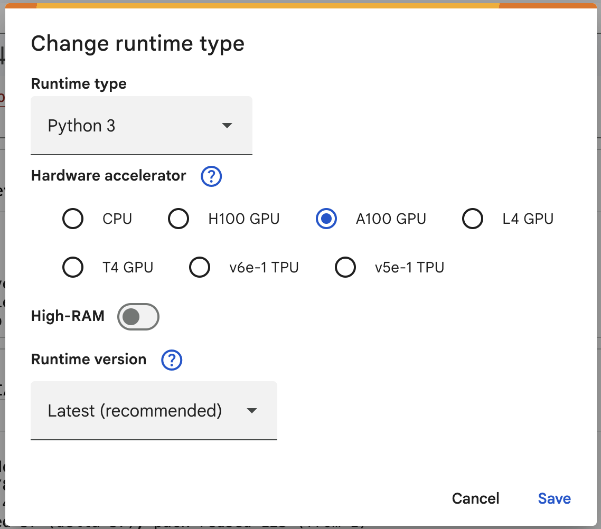
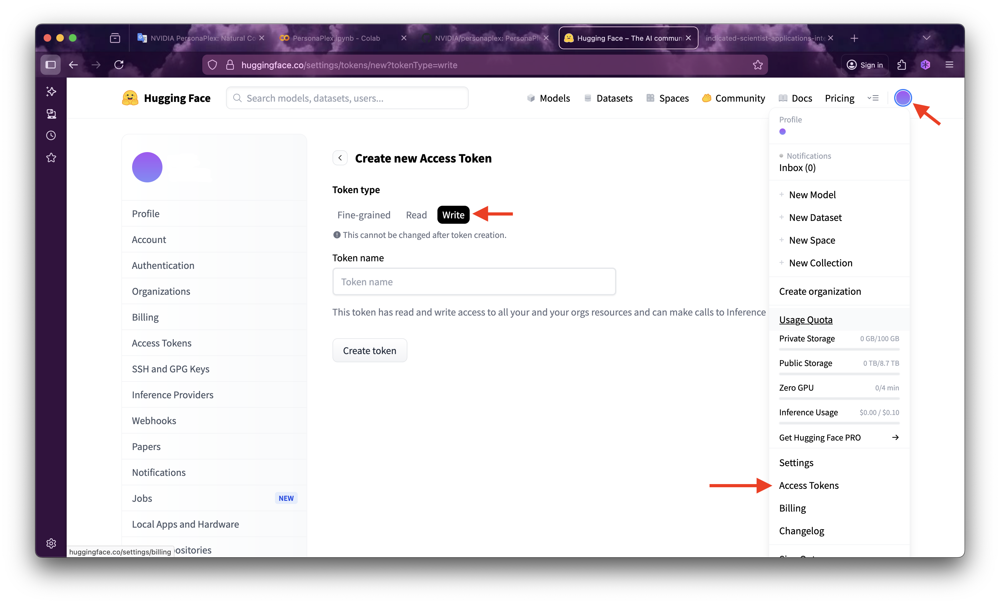
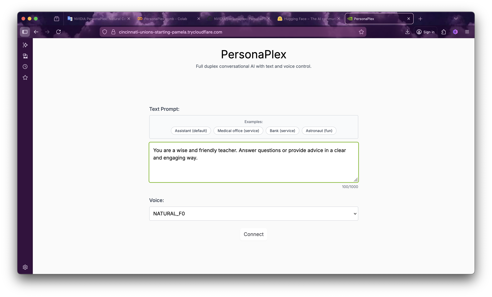
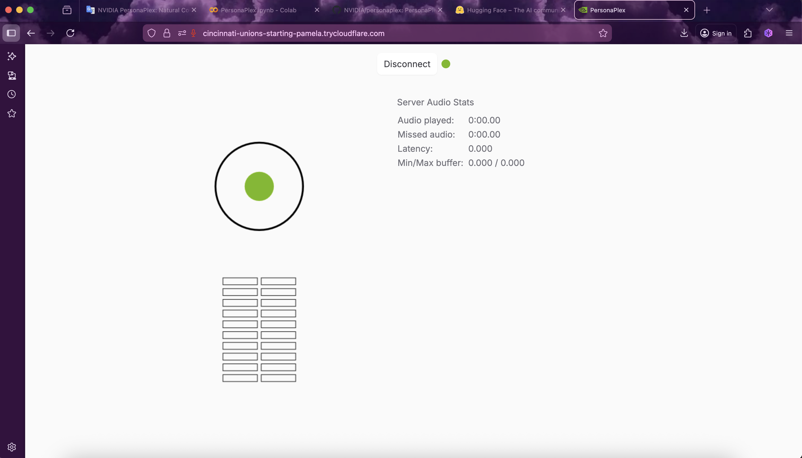

# PersonaPlex

[Türkçe](#türkçe) | [English](#english)

## Türkçe

PersonaPlex, NVIDIA ve Kyutai Labs tarafından geliştirilen **Moshi** ses modelini Google Colab üzerinde kolayca çalıştırmanızı sağlayan bir projedir. Bu notebook, karmaşık kurulum süreçlerini otomatikleştirir ve Cloudflare Tunnel kullanarak yerel bir arayüze tarayıcınızdan erişmenizi sağlar.

### Özellikler

- **Hızlı Kurulum:** Gerekli tüm bağımlılıklar (libopus, torch, transformers vb.) otomatik olarak yüklenir.
- **Düşük Gecikme:** Google Colab'ın GPU gücünü kullanarak akıcı bir ses deneyimi sunar.
- **Güvenli Erişim:** Cloudflare Tunnel (cloudflared) sayesinde port yönlendirme derdi olmadan güvenli bir URL üzerinden arayüze erişim sağlanır.
- **Kişiselleştirilebilir:** Arayüz üzerinden sistem promptunu değiştirerek modele farklı personalar kazandırabilirsiniz.

### Nasıl Çalıştırılır?

1. **Notebook'u Açın:** Aşağıdaki butona tıklayarak projeyi Google Colab üzerinde açın.

2. **GPU Ayarı:** Colab menüsünden "Düzenle > Not defteri ayarları" kısmına giderek Donanım hızlandırıcıyı "A100 GPU" (veya daha iyisi) olarak seçtiğinizden emin olun.

   

3. **Hugging Face Token & Lisans:** 
   - [nvidia/PersonaPlex](https://huggingface.co/nvidia/personaplex-7b-v1) model sayfasına giderek lisansı kabul edin.
   - [Hugging Face Ayarlar](https://huggingface.co/settings/tokens) sayfasından bir "WRITE" token oluşturun.

   

   - Notebook içerisindeki `HF_TOKEN` kısmına bu tokeni yapıştırın.

4. **Hücreleri Çalıştırın:** Baştan sona tüm hücreleri sırayla çalıştırın.

5. **Cloudflare Tunnel:** 
   - Model sunucusu çalışmaya başladığında, notebook'un sol altındaki "Terminal" kısmını açın.
   - Notebook'ta belirtilen `cloudflared` komutunu terminale yapıştırın.
   - Oluşan `https://...trycloudflare.com` bağlantısına tıklayarak arayüze erişin.

   

   

### Önemli Notlar

- Tarayıcı üzerinden mikrofon erişimine izin vermeyi unutmayın.
- Eğer bağlantı hatası alırsanız, tünelin doğru çalıştığından ve URL'nin `https` olduğundan emin olun.

---

## English

PersonaPlex is a project that allows you to easily run the **Moshi** voice model, developed by NVIDIA and Kyutai Labs, on Google Colab. This notebook automates complex installation processes and provides access to a local interface from your browser using Cloudflare Tunnel.

### Features

- **Fast Setup:** All necessary dependencies (libopus, torch, transformers, etc.) are installed automatically.
- **Low Latency:** Uses Google Colab's GPU for a smooth voice experience.
- **Secure Access:** Secure URL access via Cloudflare Tunnel without port forwarding.
- **Customizable:** Change the system prompt to give the model different personas.

### How to Run?

1. **Open the Notebook:** Click the button below to open the project on Google Colab.

2. **GPU Setting:** Set Hardware accelerator to "A100 GPU" (or better) in "Edit > Notebook settings".

3. **Hugging Face Token & License:** 
   - Log in to your Hugging Face account and accept the [PersonaPlex model license here](https://huggingface.co/nvidia/personaplex-7b-v1).
   - Create a "WRITE" token at [Hugging Face Settings](https://huggingface.co/settings/tokens).
   - Paste it into the `HF_TOKEN` variable in the notebook.

4. **Run Cells:** Run all cells.

5. **Cloudflare Tunnel:** 
   - Open **Terminal** in the notebook.
   - Run the provided `cloudflared` command.
   - Click the generated `https` link.

---

*Bu proje eğitim ve deneme amaçlı hazırlanmıştır. / This project is for educational and experimental purposes.*